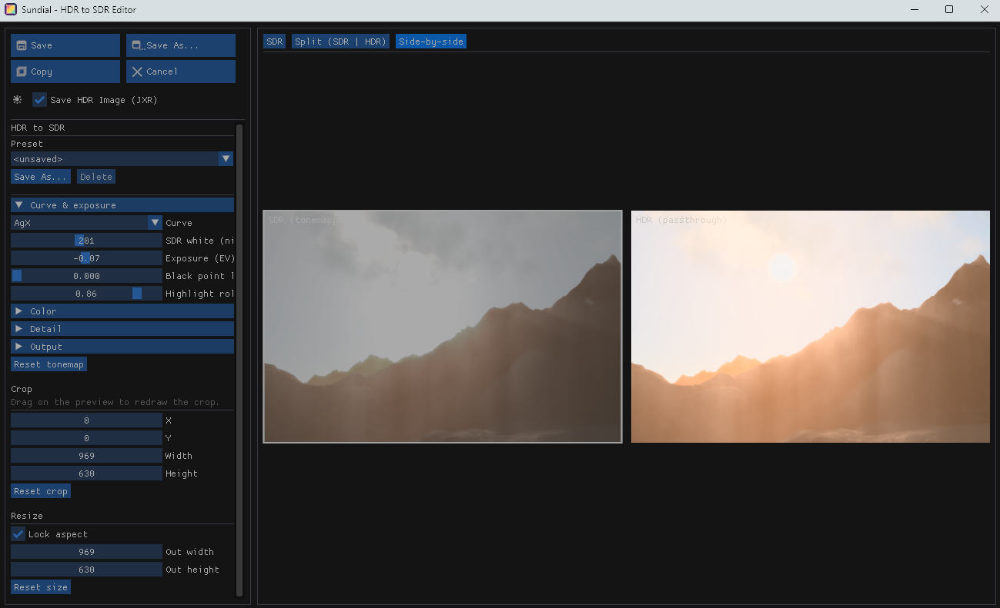
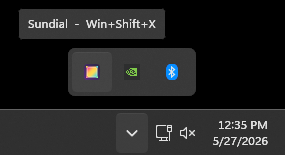
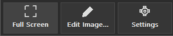

# Sundial: HDR Screen Capture Utility For Windows

Windows HDR-aware screen capture utility with support for HDR displays, including an editor to fine tune the conversion to SDR.



Sundial lives in the Windows tray. Launching it (or pressing **Win+Shift+X**) brings up the capture toolbar; the rest of the time it sits quietly in the tray.

## Installing

Download the latest **Setup.exe** from the
[Releases page](https://github.com/brendan-duncan/sundial/releases/latest) and
run it. Sundial installs per-user (no administrator prompt), brings up the
toolbar so you can capture right away, and sets itself to launch at login
(staying in the tray on startup rather than popping the toolbar).

Sundial **updates itself**: on launch it quietly checks the Releases page for a
newer version, downloads it in the background, and offers to restart into it —
nothing to configure.

## Usage

Sundial runs in the background and docks itself to the Windows tray.



Open the toolbar by clicking the tray icon, pressing **Win+Shift+X**, or
launching Sundial again (a second launch hands off to the running instance and
opens its toolbar rather than starting a duplicate). The screen darkens and the
toolbar appears at the top of the primary monitor.



### Capturing

* **Full Screen** — capture the entire primary monitor.
* **Area** — drag a rectangle on the darkened screen to capture just that
  region. **Esc** or right-click cancels.
* **Edit Image…** — re-open an existing `.jxr` (or `.png`/`.jpg`) and
  re-tone it through the same editor. You can also right-click any `.jxr`
  in Explorer and pick **Open with Sundial**.

### Recording

The **Record** button (red dot) on the toolbar starts a Snipping-Tool-style
video flow:

1. Drag a rectangle to choose the region. The selection is **persistent** —
   it has corner/edge handles (drag to resize) and can be dragged from the
   interior to move. **Esc** / right-click cancels.
2. Once a region is set, the toolbar is replaced by a floating control bar
   with a **Start** button and a timer, anchored to the selection.
3. **Start** runs a 3-second countdown shown in the middle of the rectangle,
   then recording begins and the button becomes **Stop**. The timer shows
   elapsed recording time.
4. **Stop** (or **Esc**) finishes and writes the clip.

Recordings are encoded to **H.264 / MP4** via Media Foundation and go through
the **same HDR→SDR tonemap as screenshots** (current curve/look settings,
with SDR-white and source-peak anchors seeded from the display) — so the file
is standard SDR video that plays anywhere. The control bar and selection
border use `WDA_EXCLUDEFROMCAPTURE`, so they're visible on screen but never
appear in the recording, even when they overlap the region.

### Default flow (Snipping-Tool style)

By default a capture behaves like the Windows Snipping Tool: it **does not**
open the editor. Instead it

1. converts HDR→SDR using the **current** tonemap settings,
2. saves the file(s) to `Pictures\Sundial\`,
3. copies the **SDR** image to the clipboard, and
4. shows a toast in the bottom-right with a preview thumbnail.

**Click the toast preview to open the editor** on the just-saved file (the
`.jxr` when one was kept, so re-toning starts from the full HDR data). Turn on
**Edit on Capture** if you'd rather jump straight into the editor every time.

### Settings (toolbar gear menu, or **Settings…** in the editor)

* **Edit on Capture** — open the editor immediately on each capture instead of
  the default toast flow. **Off by default.**
* **Image Snapshot Formats** — choose any combination of formats a snapshot
  writes (these are for stills; video recording has its own format settings):
  * **PNG (SDR)** — the tonemapped SDR result. **On by default.**
  * **JPEG XR / `.jxr` (HDR)** — the original FP16 scRGB capture, so you can
    re-tone later without recapturing. **On by default.** HDR captures only.
  * **Ultra HDR JPEG / `.jpg` (SDR+HDR)** — a single self-contained JPEG (SDR
    base + embedded gain map). HDR captures only; available when built with
    libultrahdr. **Off by default.**

  If only HDR formats are enabled and the capture is SDR, a PNG is written as a
  fallback so a snapshot always produces a file.
* **Auto Copy Capture** — copy the resulting **SDR** image to the clipboard
  after each save. **On by default.** (Published as `CF_DIBV5`, `CF_DIB`, and
  a real `PNG` blob, all with opaque alpha, so it pastes into Paint, Office,
  browsers, and Electron chat apps alike.)
* **Output Folder** — where snapshots are saved (defaults to `Pictures\Sundial\`).

Settings are shared via `%APPDATA%\Sundial\settings.ini`. Each editor runs as
its own process, so you can keep capturing (and open multiple editors) while one
is open; changes made in an editor's **Settings…** are picked up on the next
capture.

### Editor

The editor opens when you click a capture's toast preview, or on every capture
when **Edit on Capture** is on.

* **Curve** — tone-mapping algorithm. Default is **BT.2390 (reference)**,
  the ITU-R curve used by Windows Game Bar. **Preserve SDR**, **ACES**,
  **Hable**, **AgX**, and **Khronos Neutral** are also available.
* **SDR white (nits)** — where scRGB 1.0 sits on the SDR output. Seeded
  from the Windows HDR > "SDR content brightness" setting on every
  capture. **Auto** sets it from the 99th-percentile luminance of the
  current capture.
* **Source peak (nits)** — BT.2390's upper bound for compression. Seeded
  from the display's reported MaxLuminance. **Auto** re-reads it.
* **Exposure**, **Knee point**, **Highlight desat**, **Highlight rolloff**,
  **Black point lift** — fine-tune the curve.
* **Color** — saturation, temperature/tint, per-channel gain, gamut
  compression.
* **Detail** — unsharp-mask sharpen and a local-tonemap blend (preserves
  dark UI in front of bright HDR content).
* **Crop** — drag on the preview, or use the X/Y/W/H sliders.
* **Resize** — width/height with optional aspect lock.
* **Presets** — save/load the full slider set under any name; persisted
  to `%APPDATA%\Sundial\presets\`.
* **View** — SDR only (hold the SDR button to peek at the unmapped HDR),
  Split (drag the divider), or Side-by-side.
* **Save** (Ctrl+S) writes the enabled **Image Snapshot Formats**; **Save As…**
  (Ctrl+Shift+X) writes one explicit file you name; **Copy** (clipboard),
  **Cancel** (Ctrl+X). For HDR captures, **Save As…** also offers **Ultra
  HDR JPEG (`.jpg`)** — a single file whose base image is the tonemapped SDR
  result (so it looks identical to the `.png` everywhere) but which carries an
  embedded gain map, so HDR-aware viewers (Chrome, Windows Photos, Android,
  macOS) recover the HDR from one ordinary-looking JPEG.
* **Settings…** — opens the snapshot-format and output settings (same set as
  the toolbar gear menu) without leaving the editor.

### Hotkeys

| Shortcut | Action |
|---|---|
| **Win+Shift+X** | Show the Sundial toolbar |
| **Esc** / right-click | Cancel area/region selection |
| **Esc** (while recording) | Stop recording and save |
| **Ctrl+S** | Editor: Save |
| **Ctrl+Shift+X** | Editor: Save As… |
| **Ctrl+X** | Editor: Cancel |

### Output

Captures land in `Pictures\Sundial\` (which OneDrive may redirect). An HDR
capture writes one file per enabled **Image Snapshot Format**, all sharing the
same stem:

* `sundial_YYYYMMDD_HHMMSS.png` — tonemapped SDR result.
* `sundial_YYYYMMDD_HHMMSS.jxr` — original FP16 scRGB, so you can re-tone via
  **Edit Image…** without recapturing.
* `sundial_YYYYMMDD_HHMMSS.jpg` — Ultra HDR JPEG (SDR base + gain map).

The toast preview re-opens the richest file written (`.jxr` if present, so
re-toning starts from the full HDR data, otherwise the `.png`).

Recordings land in the same folder as `sundial_YYYYMMDD_HHMMSS.mp4` (H.264,
tonemapped SDR).

The toast notification in the bottom-right shows a preview of the result.
Clicking a **screenshot** toast opens that file in the editor; clicking a
**recording** toast opens the `.mp4` in Explorer.

## Build and run

```powershell
.\build.bat           # configures on first run, incrementally builds after
.\build\Release\sundial.exe
```

ImGui and [libultrahdr](https://github.com/google/libultrahdr) (for Ultra HDR
JPEG export) are fetched on first configure via `FetchContent` — needs internet
for the initial configure. libultrahdr builds its own libjpeg-turbo from source
(SIMD disabled, so no NASM needed). `build.bat` sets
`CMAKE_POLICY_VERSION_MINIMUM=3.5` so that bundled libjpeg-turbo (which targets
an older CMake) configures under CMake 4.x. Build without Ultra HDR support via
`-DSUNDIAL_ENABLE_ULTRAHDR=OFF`.

If the build directory is stale (older generator cached), delete it:

```powershell
Remove-Item -Recurse -Force build
.\build.bat
```

## Runtime model

- Single instance enforced by a named mutex `SundialInstance.v1`.
- Global hotkey **Win+Shift+X** shows the toolbar (does not capture
  immediately).
- No tray icon yet — exit via Task Manager.
- Pictures path comes from `FOLDERID_Pictures`, which redirects through
  OneDrive on this user's machine. Captures actually land in
  `C:\Users\brend\OneDrive\Pictures\Sundial\`.
- Settings live at `%APPDATA%\Sundial\settings.ini` (flat `key = value`).

## Architecture (`src/`)

| File | Responsibility |
|---|---|
| `main.cpp` | wWinMain, hotkey loop, single-instance, orchestrates capture → save → clipboard → toast (or editor when **Edit on Capture** is on). Handles the toast's "click preview to edit" message back on the main thread |
| `Clipboard.{h,cpp}` | Copy an SDR BGRA8 image (or a tonemapped frame) to the clipboard as `CF_DIBV5` + `CF_DIB` + a `PNG` blob, forcing opaque alpha. Shared by `main.cpp` and the editor's Copy button |
| `HdrCapture.{h,cpp}` | DXGI Desktop Duplication, primary-monitor only. Produces `Frame` (FP16 scRGB when display is in HDR mode, BGRA8 otherwise) |
| `Settings.{h,cpp}` | `AppSettings { editOnCapture, TonemapParams }`. INI-style load/save in `%APPDATA%\Sundial\settings.ini` |
| `Tonemap.{h,cpp}` | CPU tonemap (`TonemapToBgra8(frame, params)`). Used on save |
| `ShaderTonemap.{h,cpp}` | D3D11 pixel-shader version of the same tonemap for live editor preview and video recording. Must stay in sync with `Tonemap.cpp`. `SetSourceTexture()` feeds it a GPU texture directly (no CPU upload) for the recorder |
| `VideoRecorder.{h,cpp}` | Screen recording. Worker-thread DXGI duplication loop → GPU crop → `ShaderTonemap` HDR→SDR → Media Foundation `IMFSinkWriter` (H.264/MP4). Own D3D11 device, isolated from the main thread |
| `ImageOps.{h,cpp}` | CPU crop + bilinear resize for both FP16 and BGRA8 frames |
| `Encoder.{h,cpp}` | WIC writers — JXR (`GUID_ContainerFormatWmp` + `64bppRGBAHalf`), PNG (`32bppBGRA`). Also `SaveUltraHdrJpeg` — Ultra HDR JPEG (SDR base + embedded gain map) via libultrahdr, fed the tonemapped SDR plus the linear scRGB source scaled so SDR white = 1.0 |
| `Toast.{h,cpp}` | Bottom-right layered notification window with an optional preview thumbnail. Takes an `onClick` callback (screenshots open the editor, recordings open Explorer). Runs on its own thread |
| `Toolbar.{h,cpp}` | Top-centre floating toolbar — Full Screen / Record / Edit Image / Settings (Area is drag-on-overlay). Also drives the full video flow: persistent selection with handles, control bar, countdown, recording. Settings is a `TrackPopupMenu` (no dialog) |
| `AreaSelector.{h,cpp}` | Full-screen layered overlay; drag rectangle, ESC/right-click cancels |
| `Editor.{h,cpp}` | "Edit on Capture" window — ImGui sidebar + D3D11 live preview. Tonemap sliders, crop, resize, Save/Cancel |

## Capture pipeline (HDR-relevant)

1. `IDXGIOutput5::DuplicateOutput1` requested with
   `[R16G16B16A16_FLOAT, B8G8R8A8_UNORM]` in that order — DDA returns FP16
   scRGB when the display is in HDR mode, BGRA8 otherwise.
2. `GetPrimaryOutput6()` walks every adapter/output for
   `MONITORINFOF_PRIMARY` — using `EnumAdapters(0)`/`EnumOutputs(0)`
   silently returned empty frames on this machine.
3. `AcquireNextFrame` releases-and-reacquires until
   `LastPresentTime.QuadPart != 0`, with a small attempt budget so a
   perfectly static desktop still captures. Without this, DDA's first
   resource was empty → all-black captures.
4. `Frame.isHdr == true` only when the source format came back FP16. The
   editor's `ShaderTonemap` is fed the FP16 data directly; the CPU path
   shares the same maths (must stay in sync if either changes).

## HDR → SDR knobs

Exposed in the editor and persisted in `settings.ini`:

**Curve & exposure**
- `sdrWhiteNits` — where scRGB "1.0" sits on the SDR output. Internally
  `whiteScale = 80 / sdrWhiteNits` (scRGB convention: 1.0 = 80 nits). The
  editor has an **Auto** button that picks this from the 99th-percentile
  luminance of the captured frame (`AutoSdrWhite()` in Tonemap.cpp).
- `exposureEV` — pre-tonemap exposure in stops.
- `curve` — `LinearClip | Reinhard | Aces | Hable | AgX | Neutral`. AgX is
  the Blender log-sigmoid (3x3 input/output matrices + polynomial contrast),
  Neutral is the Khronos PBR Neutral curve (gentler than ACES on
  mid-tones, used by glTF previews).
- `blackPointLift` — post-curve shadow lift; `c <- c + lift * (1 - c)`.
- `highlightRolloff` — pre-curve knee at 0.7; pulls bright values back
  before the main curve. Useful for blown-highlight HDR content.

**Color**
- `saturation` — luminance-grayscale blend, 1.0 = unchanged.
- `temperature` / `tint` — two-axis colour shift (warm/cool, green/magenta).
- `gamutCompress` — pulls colors that go out of [0,1] toward gray, instead
  of clipping. Cheap approximation; the real ACES gamut compressor is more
  involved.
- `rGain` / `gGain` / `bGain` — per-channel multipliers in scene-linear
  space (alternative to temperature/tint for white-balance tweaks).

**Detail**
- `sharpen` — unsharp-mask amount on the source (4-tap cross neighbours).
  Applied in scene-linear space *before* the curve, both on GPU preview and
  on CPU save, so the two paths match.

**Output**
- `outputGamma` — `Srgb | Gamma22 | Linear`. Linear skips the gamma encode
  entirely (PNG viewers will treat the file as sRGB and it'll look dark and
  contrasty — only useful when the file is consumed by something
  gamma-aware).

Both `Tonemap.cpp` (CPU) and `ShaderTonemap.cpp` (HLSL string literal,
compiled at runtime) implement these identically. Changing one without the
other will desync the editor preview from the saved PNG.

### Editor preview modes

- **SDR only** (default) — shows the tonemapped result. A "Hold to view HDR"
  button temporarily switches to the passthrough view (linear scRGB clipped
  to [0,1] + sRGB gamma) so the user can see where the tonemap is
  recovering highlight detail.
- **Split (SDR | HDR)** — vertical divider with a draggable handle; SDR
  left, HDR-passthrough right, same UV coordinates so the divide is
  spatially aligned.
- **Side-by-side** — two letterboxed panels with labels.

Implemented as two render targets in `ShaderTonemap`: `RenderSdr(params)`
populates the SDR SRV; `RenderHdrPassthrough()` populates the HDR one. The
editor only renders the HDR one when a comparison mode actually needs it.

## Editor flow

- Each editor runs as a **separate `sundial.exe` process** (the resident
  tray/capture process spawns it and returns immediately), so multiple editors
  can be open and the hotkey still captures while they are. A fresh capture is
  handed to the child losslessly via a `%TEMP%\sundial_handoff_*` file (`.jxr`
  for HDR, `.png` for SDR), deleted when the editor exits.
- Triggered when `AppSettings::editOnCapture == true`, by clicking a capture
  toast, or via **Edit Image…**.
- ImGui sidebar (~320 px) on the left, live D3D11 preview on the right.
  Preview re-renders every frame via `ShaderTonemap::Render` so slider
  changes are instant.
- Crop is shown as a dim overlay around the selection; sliders for X/Y/W/H.
  Interactive (mouse-drag) crop isn't built yet.
- Resize is width/height inputs with aspect lock.
- Save → applies crop + resize to the FP16/BGRA8 source, persists tonemap
  params + settings to `settings.ini`, then writes every enabled **Image
  Snapshot Format** (PNG / JXR / Ultra HDR JPEG). Save As writes one explicit
  file.
- Cancel → nothing is saved.

## Conventions / things to keep in mind

- `Frame.pixels` is tightly packed (no row padding): FP16 RGBA when HDR,
  BGRA8 otherwise. `bytesPerPixel` distinguishes them.
- Tonemap and shader must keep their maths identical. Currently:
  `c = max(0, src.rgb) * (80/sdrWhiteNits) * 2^EV`, apply curve, apply
  saturation, encode sRGB.
- The CMake target list at the top of `CMakeLists.txt` is the source of
  truth — adding a new `.cpp` requires editing it.
- ImGui is built as a separate static target; `target_compile_options(imgui
  PRIVATE /W0)` because ImGui sources aren't warning-clean at /W4.
- Don't pull in OneDrive vs. local-Pictures logic — `FOLDERID_Pictures`
  handles it.

## Known gaps / non-goals (right now)

- Multi-monitor: capture and recording both cover the primary monitor only.
- No HDR metadata (MaxCLL, MaxFALL, ICC) embedded in the JXR — Windows
  Photos still recognises it as HDR via the FP16 pixel format alone.
- Area capture path captures the full primary monitor then crops in CPU
  (fine for stills).
- Video recording:
  - Output is **SDR** (tonemapped) H.264/MP4 — no HDR-preserving output
    (HEVC Main10 + HDR10 metadata) yet.
  - No audio capture.
  - The recorder reads back each tonemapped frame to the CPU before
    encoding rather than feeding a GPU surface straight to the encoder; the
    loop targets 30 fps.
  - `DXGI_ERROR_ACCESS_LOST` (an HDR/resolution toggle mid-recording) stops
    the recording cleanly instead of re-establishing duplication.

## Releasing

Releases use [Velopack](https://velopack.io) for both the installer and the
in-app updater. The native Velopack library lives in `third_party/velopack`
(fetched by `tools/setup-velopack.ps1`) and is not committed — the build links
it in automatically when present and stubs the updater out when it isn't.

### Automated (GitHub Actions)

Pushing a version tag builds and publishes a release automatically
([.github/workflows/release.yml](.github/workflows/release.yml)):

```sh
git tag v1.2.0
git push origin v1.2.0
```

The workflow vendors Velopack, builds Release, and runs `vpk` to publish the
`Setup.exe` plus full/delta packages to the GitHub Release for that tag. Because
the in-app updater points at `releases/latest/download`, every installed copy
finds the new version on its next launch — no extra steps. It uses the built-in
`GITHUB_TOKEN`, so there are no secrets to configure.

### Manual (local)

```powershell
dotnet tool install -g vpk          # one-time: the Velopack CLI

tools\setup-velopack.ps1            # one-time: vendor the native lib
cmake -S . -B build
cmake --build build --config Release

# pack only -> releases\Sundial-win-Setup.exe
tools\release.ps1 -Version 1.2.0

# or pack AND publish to GitHub
tools\release.ps1 -Version 1.2.0 `
  -RepoUrl https://github.com/brendan-duncan/sundial -Token $env:GH_PAT
```

The first `Setup.exe` is the one-time installer to hand to new users; every
later, higher-versioned release is what existing installs auto-update to.

> **Code signing:** unsigned builds trigger a SmartScreen warning on first run.
> When you have a certificate, pass it to `vpk` via `--signParams` (wire it
> through `tools/release.ps1`).
